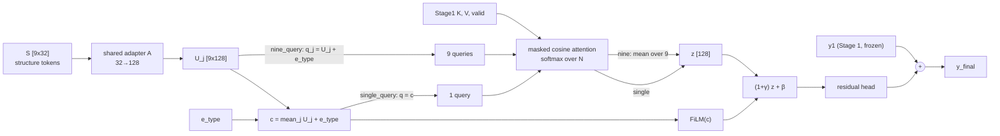

# Stage 2: structure tokens with cross-attention and FiLM

Stage 2 keeps the Stage 1 prediction `y1` and adds a structure-conditioned residual.
Two query designs are compared under identical conditions:

* `single_query` (baseline): one query from the averaged structure tokens.
* `nine_query` (comparison): one query per structure token, then mean-pooled.

The two models differ only in where the query comes from and where pooling happens.
Every other module (adapter, type embedding, temperature, FiLM, head) is identical,
and the trainable parameter count is the same by construction.

## Shapes (batch dimension omitted)

| symbol | shape | meaning |
|---|---|---|
| S | 9 × 32 | structure tokens; token j ↔ `STRUCT_TOKEN_NAMES[j]` |
| U_j | 128 | `A(S_j)`, one shared affine map A: 32 → 128 |
| e_type | 128 | variant-type embedding (missense / synonymous / indel) |
| c | 128 | `mean_j(U_j) + e_type`, global condition, used by FiLM |
| K, V | N × 128 | Stage 1 `unified_reference_delta` attention keys/values |
| valid | N | Stage 1 `attention_valid` (padding = 0) |

## Equations

```
single_query:  q = c                       -> weights [B, 1, N],  z = Σ_i a_i V_i
nine_query:    q_j = U_j + e_type          -> weights [B, 9, N],  z = mean_j Σ_i a_ji V_i

a = softmax over N of ( cos(q, K_i) / tau + mask_i )     (softmax never runs over queries)
tau = softplus(log_tau) + 1e-4                           (same parameterization as Stage 1)

[gamma, beta] = FiLM(c)          d -> 32 -> 2d, GELU, last layer zero-initialised
z_mod = (1 + gamma) * z + beta
delta = Head(z_mod)              d -> 32 -> 1, GELU, last layer zero-initialised
y_final = y1 + delta             y1 = Stage 1 prediction in z-score units
```

Initial `y_final` equals `y1` exactly (both last layers are zero), and no per-query
parameters exist in either mode.

## Structure tokens

Only Block A is used. Block B (indel seam features) is excluded.

| token | source column (rad51c_struct_features.csv) |
|---|---|
| 0 plddt | `A_plddt` |
| 1 rsasa | `A_rsasa` |
| 2 dist_walker_a | `A_dist_walker_a` |
| 3 dist_walker_b | `A_dist_walker_b` |
| 4 dist_atp_contact | `A_dist_atp_contact` |
| 5 dist_ssdna_binding | `A_dist_ssdna_binding` |
| 6 dist_bcdx2_interface | `A_dist_bcdx2_interface` |
| 7 dist_cx3_interface | `A_dist_cx3_interface` |
| 8 secondary_structure | `A_ss_helix/sheet/loop` one-hot, code 0/1/2 |

The learned tokenizer is **not in this repository yet**. Its contract is in
`src/stage2/structure.py`: input `{"continuous": [B, 8], "ss": [B]}`, output
`[B, 9, 32]`, and `fit_preprocessing(train_raw)` which may only see the train split.
Real training refuses to start without `--tokenizer module:factory`.

Structure rows are joined to the cohort by `var_id`. Duplicates, missing
variants, NaN values, non-one-hot secondary structure, and split disagreements with
`split_manifest.csv` are all hard errors.

## Freeze scope

| mode | Stage 1 | ESM | tokenizer | adapter / type / τ / FiLM / head |
|---|---|---|---|---|
| `frozen_stage1` (default) | frozen, eval | frozen | trained | trained |
| `joint_l2sp` (not run by default) | `unfreeze` submodules trained at `lr × stage1_lr_ratio` | frozen | trained | trained |

`joint_l2sp` anchors the unfrozen Stage 1 parameters with
`lambda_sp × Σ ||θ − θ_ref||²` (reduction `sum`). `θ_ref` is copied once at the
start of joint training. It is not the AdamW weight decay.

## Usage

```bash
# real training (needs the learned tokenizer)
python train_stage2.py --query-mode single_query \
    --stage1-ckpt runs/stage1_v2/unified_reference_delta/W10/shipped_split/seed44/best.pt \
    --tokenizer <package.module:factory> --out runs/stage2/single_query/seed44

python train_stage2.py --query-mode nine_query \
    --stage1-ckpt runs/stage1_v2/unified_reference_delta/W10/shipped_split/seed44/best.pt \
    --tokenizer <package.module:factory> --out runs/stage2/nine_query/seed44

# smoke test only (synthetic tokenizer, results are not Stage 2 performance)
python train_stage2.py --query-mode nine_query --stage1-ckpt <best.pt> \
    --synthetic-tokenizer --smoke-n 64 --max-epochs 2 --out /tmp/stage2_smoke
```

Model selection uses validation `subset` (missense + indel mean Spearman, same as Stage 1),
with patience 10 and max 120 epochs. Test is evaluated once on the selected checkpoint.

## Shared versus differing paths



## Known gaps

* No learned `StructureTokenizer` in the repository. Real training is blocked until it is supplied.
* The smoke tokenizer is a fixed affine map and must not be used for any reported result.
* Attention entropy and gamma/beta statistics are logged for analysis only. They are not causal evidence.
